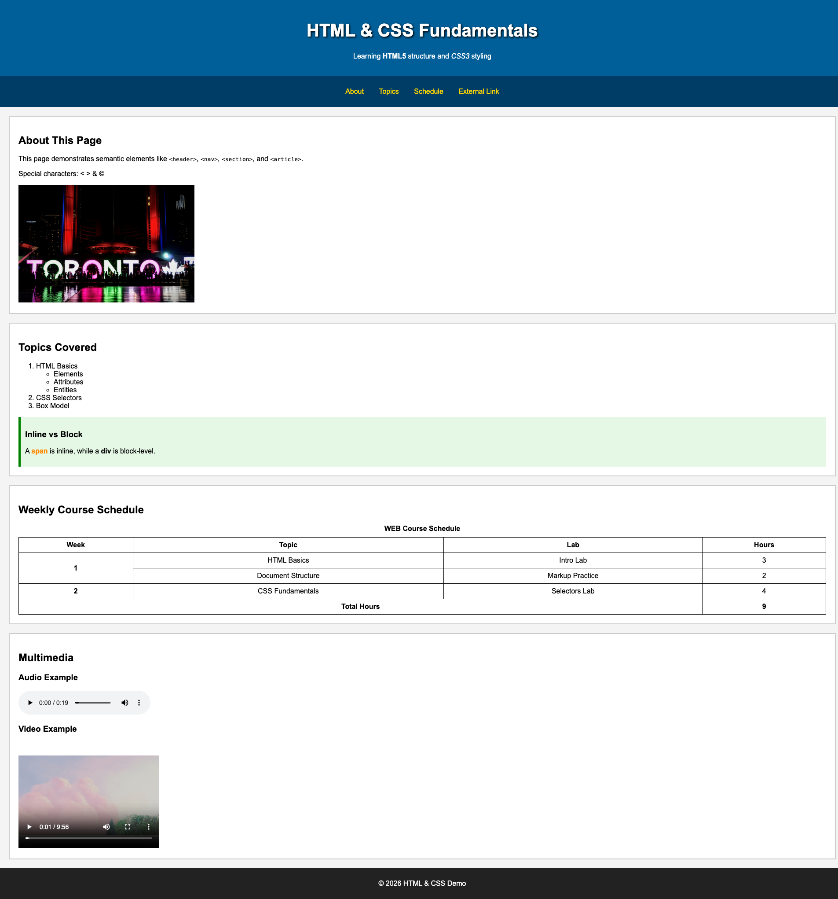

# WEB700 – Assignment 4

## Express Static Server and Single-Page HTML/CSS

---

## Objective

Create a **new** Express server that serves **one static HTML page** matching the layout and content shown in the reference image. Use a **separate CSS file** for all styling. Navigation links must work as specified below.

---

## Reference

Your HTML page must look like the reference image below. Use it as the visual guide for layout, content, and styling.

**Reference image:**



- **Header** (dark blue): title “HTML & CSS Fundamentals”, subtitle “Learning HTML5 structure and CSS3 styling”, and a horizontal navigation bar.
- **Main content** (white sections with light grey borders):
  1. **About This Page** – text about semantic elements, special characters (`< > & ©`), and an image (e.g. Toronto sign).
  2. **Topics Covered** – ordered list with nested unordered list (e.g. HTML Basics → Elements, Attributes, Entities; CSS Selectors; Box Model), plus a highlighted “Inline vs Block” box with green styling.
  3. **Weekly Course Schedule** – table with caption “WEB Course Schedule”, columns Week / Topic / Lab / Hours, multiple data rows, and a “Total Hours” footer row (e.g. using `colspan`).
  4. **Multimedia** – “Audio Example” with an HTML5 audio player, “Video Example” with an HTML5 video player. Use the **audio and video examples from the course material** (HTML & CSS notes); the audio and video must be **playable** (with working play/pause and controls).
- **Footer** (dark grey/black): e.g. “© 2026 HTML & CSS Demo”.

Use the image as the visual guide for colours, spacing, borders, and structure.

---

## Step 1: Project Setup

1. Create a new folder (e.g. `assignment4`).
2. Run `npm init` (defaults are fine).
3. Run `npm install express`.
4. Add `node_modules` to a `.gitignore` file.
5. Use this structure:

   ```
   assignment4
   ├── public
   │   ├── index.html
   │   └── css
   │       └── main.css
   ├── server.js
   ├── package.json
   └── .gitignore
   ```

---

## Step 2: Express Server

In **server.js**:

- Create an Express app and use `express.static("public")` so that files in `public` are served at the root.
- Start the server on port **8080** (or `process.env.PORT` if set).
- Log a message when the server starts (e.g. “Server listening on port 8080”).

Visiting `http://localhost:8080/` must serve `public/index.html`.

---

## Step 3: Single HTML Page (index.html)

Create **public/index.html** as a **single page** that includes:

- Valid HTML5 structure: `<!DOCTYPE html>`, `<html>`, `<head>`, `<body>`, `<meta charset="utf-8" />`, `<title>`.
- A link in `<head>` to your external stylesheet:  
  `<link rel="stylesheet" href="/css/main.css" />`
- **Semantic layout**: `<header>`, `<nav>`, `<main>` (with `<section>` or `<article>` for each content block), `<footer>`.
- **Content** matching the reference:
  - Header with title and subtitle.
  - Nav with four links: **About**, **Topics**, **Schedule**, **External Link**.
  - Sections for “About This Page”, “Topics Covered” (with list and highlight box), “Weekly Course Schedule” (table with caption, thead, tbody, tfoot), and “Multimedia” (audio and video).
  - **Multimedia:** Use the audio and video examples from the **course material** (HTML & CSS topic). The `<audio>` and `<video>` elements must include `controls` and point to actual playable media URLs so that users can play, pause, and use the players.
  - Footer with copyright-style text.

Give each target section an **id** so the nav can jump to it, for example:

- About section → `id="about"`
- Topics section → `id="topics"`
- Schedule (table) section → `id="table-section"` (or `id="schedule"`)

---

## Step 4: Navigation Behaviour

- **About** – must navigate to the **About** section on the same page (use `href="#about"` or the id you chose).
- **Topics** – must navigate to the **Topics** section on the same page (e.g. `href="#topics"`).
- **Schedule** – must navigate to the **Schedule** (table) section on the same page (e.g. `href="#table-section"` or `href="#schedule"`).
- **External Link** – must open **https://developer.mozilla.org** in a **new tab** (use `target="_blank"` and `rel="noreferrer"` or `rel="noopener noreferrer"`).

---

## Step 5: CSS (Separate File)

Put **all** styling in **public/css/main.css**. Do not rely on inline styles for the required layout and look.

Your CSS must produce a page that **visually matches** the reference image, including:

- Header and footer background colours (e.g. dark blue, dark grey/black).
- White content areas with light grey borders and spacing.
- Styled navigation (e.g. horizontal list, link colours).
- Table with borders (e.g. 1px solid, light grey or black).
- Green-tinted highlight box for “Inline vs Block”.
- Typography and spacing so the layout is clear and readable.

You are free to choose exact colours and pixel values as long as the result is clearly consistent with the reference.

---

## Step 6: Deployment to Vercel

You must deploy your application to **Vercel**.

Requirements:

- The deployed application must run without errors
- The page must load correctly on the deployed version, and all navigation (About, Topics, Schedule, External Link) must work
- You must include the **live Vercel URL** in your submission

---

## Notes

- One HTML file only: **index.html**. No separate about.html or schedule.html.
- All styles in **main.css**; no inline styles for the main design.
- Use valid HTML5 and semantic elements. You may validate at [html5.validator.nu](https://html5.validator.nu/) or [validator.w3.org](https://validator.w3.org/).
- The application must run locally and on Vercel.

---

## Assignment Submission

At the top of **server.js**, include:

```js
/**********************************************************************************
WEB700 – Assignment 04
I declare that this assignment is my own work in accordance with Seneca Academic Policy.
No part of this assignment has been copied manually or electronically from any other source
(including 3rd party web sites) or distributed to other students.
Name: ______________________
Student ID: _________________
Date: __________________
**********************************************************************************/
```

Submit your project (ZIP or repository link) with:

- **server.js**
- **public/index.html**
- **public/css/main.css**
- **package.json**
- **.gitignore**
- **Live Vercel URL** (link to your deployed site)

---

## Checklist

- [ ] New Express server using `express.static("public")`, runs on port 8080.
- [ ] Single **index.html** with structure and content matching the reference image.
- [ ] **About**, **Topics**, and **Schedule** links scroll to the correct section on the page.
- [ ] **External Link** opens https://developer.mozilla.org in a new tab.
- [ ] All styling in **main.css**; page looks like the reference (header, sections, table, footer, colours, borders).
- [ ] **Multimedia:** Audio and video from course material; both are **playable** (controls work).
- [ ] Deployed to **Vercel**; live URL included in submission.
